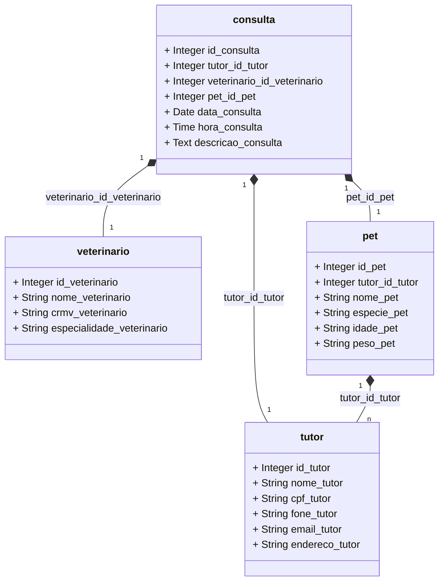

<b>Banco de Dados de uma Clínica Pet-Shop:</b> 
Prova para a disciplina Programação Web na faculdade.

<b>Diagrama de classes (Talvez os relacionamentos estjam errados)</b>

<b>Dependências:</b> 
<b>Bootstrap</b>- use o link abaixo ou pesquise no seu navegador-
https://getbootstrap.com . 
<b>SQL</b> feito pelo <b>DBDesigner</b>.

<b>Atenção:</b> 
Para usar o projeto, lembre-se de alterar o diretório no começo dos códigos e verifique o nome colocado nas tabelas.

<b>Explicação</b> 
O objetivo desse projeto é praticar o CRUD utilizando uma clínica de exemplo, a 1° versão do projeto é uma clínica normal e pode ser vista aqui -
https://github.com/Soueu01games/Projeto-programacao-web-Emanuela  
Essa versão é mais complexa pois adiciona a classe Tutor e Pet ao invés de Paciente. O Pet precisa de um tutor para ser criado, 
e uma consulta precisa do Veterinário, do Pet e do Tutor. 
Eu pretendo adicionar o CSS de um projeto do 1° semestre (uma página Index de uma clínica de petshop feita com bootstrap), foi por causa dessa página que mudei o tema da clínica. 
Seria legal criar uma função de login mas acho que não conseguiria fazer . Seria bom se eu conseguisse impedir de um veterinário ter 2 consultas no mesmo horário, mas não faço ideia 
de como implementaria. Acho que o que dá pra fazer é tornar algumas informações obrigatórias de preencher como o Tutor na hora de cadastrar pet e etc.

Última Atualização- 21/11/2024
